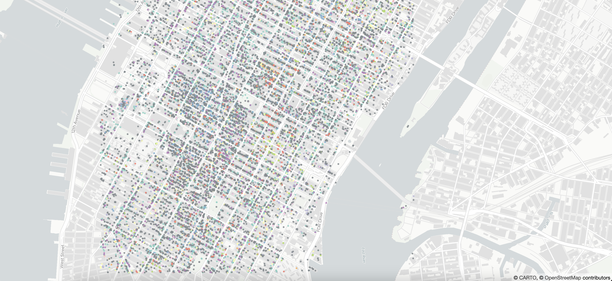

# Fast prototyping using Builder & Deck.gl

## Context

This section has an example application in HTML standalone format (index.html) with CARTO for Deck.gl `fetchMap` function implementation. Full documentation on this topic can be found [here](https://docs.carto.com/deck-gl/rapid-map-prototyping/)

## Steps to reproduce

1. Create a Builder map
2. Add layers and style as desired
3. Publish the map and retrieve the Map ID
4. Input the Map ID in the CARTO for Deck.gl application

